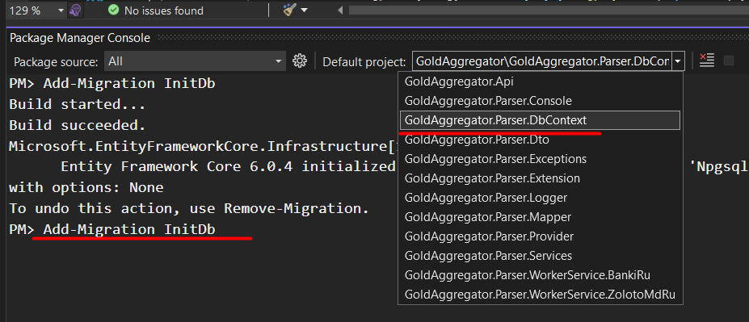

# README #

Gold aggregator

### What is this repository for? ###

* Website Url
* [Gold aggregator website](https://goldagregator.ru)

### How to add migraton using ORM EF in Gold  ###

Select default project "GoldAggregator.Parser.DbContext", startup project "GoldAggregator.Api"

Or in Packages Manager in VS execute string bellow
> Add-Migration Initialcreate -StartupProject GoldAggregator.Api\GoldAggregator.Api -Project GoldAggregator.Parser\GoldAggregator.Parser.DbContext

<!--
<details>
  <summary markdown="span">Пример на скриншоте </summary>
	
</details> 
-->

dotnet ef database update --project GoldAggregator.Api\GoldAggregator.Api

-------------------------------------------------------------------------------

### Как убить сессию на базу данных

``` SQL
-- Посмотреть активные сессию
select * from pg_stat_activity where datname like '%ParserDbContext%';
-- Убрать сессию
select pg_terminate_backend(pid) from pg_stat_activity where datname = 'ParserDbContext';
-- Удалить базу
drop database 'ParserDbContext';
```
